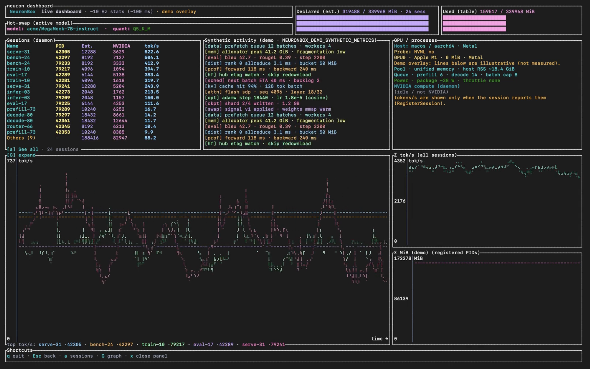

# NeuronBox

**Run local AI work (training, fine-tuning, inference, benchmarks) without reinventing glue code every week.**

**Website:** [neuronbox.dev](https://neuronbox.dev)



You describe the project once in **`neuron.yaml`**: where weights live (Hugging Face–style id, a folder on disk, or a single file), which Python stack you need, GPU expectations, and the script to run. NeuronBox builds or reuses a **hashed virtualenv** under `~/.neuronbox/store/envs/`, wires **`NEURONBOX_*` environment variables** into your process, and talks to a **Unix-socket daemon** (`neurond`) so **`neuron stats`** and **`neuron dashboard`** show **live sessions**, host/GPU probes, and **tokens per second** (automatically detected via hooks for **transformers**, **vLLM**, **llama.cpp**, and **OpenAI-compatible** clients). For hard isolation, use **`neuron run --oci`** with **`runtime.mode: oci`** in the manifest—Docker is used only on that path; OCI runs do **not** register a session with `neurond`.

**`neuron`** with no subcommand opens a short **getting-started** screen; **`neuron help`** lists every command.

**Scope:** NeuronBox is a **working local stack**: CLI, `neurond`, newline-delimited JSON on a Unix socket, terminal dashboard, and a **global model store**. It is **not** a hosted multi-tenant cloud. Version **0.1.0** is early but usable; APIs and CLI flags may still evolve.

**License:** [GNU Affero General Public License v3](LICENSE) (open source). SPDX identifier in manifests: **`AGPL-3.0-only`**. If you cannot meet AGPL obligations (e.g. closed-source SaaS), you need a **commercial license** — see [LICENSING.md](LICENSING.md) and contact **neuronbox.contact@proton.me**.

---

## Contents

- [Why NeuronBox (at a glance)](#why-neuronbox-at-a-glance)
- [Tutorial: end-to-end](#tutorial-end-to-end)
- [How a run works](#how-a-run-works)
- [Daemon, sessions, and throughput](#daemon-sessions-and-throughput)
- [Dashboard and demo mode](#dashboard-and-demo-mode)
- [Use cases](#use-cases)
- [NeuronBox vs Docker](#neuronbox-vs-docker)
- [CLI reference](#cli-reference)
- [Environment variables](#environment-variables)
- [Prerequisites and build](#prerequisites-and-build)
- [References](#references)
- [Repository layout](#repository-layout)
- [Contributing](#contributing)

---

## Why NeuronBox (at a glance)

1. **Declare the job, not the plumbing**: **`gpu.min_vram`**, **`runtime.packages`**, **`model.source`**, and **`entrypoint`** live in **`neuron.yaml`** instead of ad-hoc CUDA matrices and one-off volume maps.

2. **Model store, not a 50 GB image layer**: weights are **first-class artifacts** in **`~/.neuronbox/store`**, shared across projects, with paths exposed via **`NEURONBOX_MODEL_DIR`** (and related vars). **`neuron pull`** fetches Hugging Face–style **`org/model`** trees into that store (see **`neuron pull --help`** for aliases and local paths).

3. **Hot-swap for iteration**: **`neuron swap`** updates daemon state and **`~/.neuronbox/swap_signal.json`**; **`neuron serve`** runs a long-lived Python worker that can react without cold-starting your whole stack for every weight change.

4. **One view of the machine**: **`neuron host inspect`** and **`neuron gpu list`** summarize **Metal, ROCm, CUDA**, and optional **NVML** so laptops and Linux servers share one mental model.

---

## Tutorial: end-to-end

### 1. Build the binaries

From your clone:

```bash
cd neuronbox
cargo build -p neuronbox-cli -p neuronbox-runtime --bin neurond
```

You need **`target/debug/neuron`** and **`target/debug/neurond`** side by side (or set **`NEUROND_PATH`** to the daemon binary). Add **`target/debug`** to **`PATH`** if you like.

```bash
./target/debug/neuron          # welcome screen
./target/debug/neuron help     # full command list
```

### 2. Create a project

```bash
mkdir ~/my-llm-project && cd ~/my-llm-project
/path/to/neuronbox/target/debug/neuron init
```

Edit **`neuron.yaml`**: **`model`**, **`entrypoint`**, **`runtime.packages`**, **`gpu.min_vram`**, **`runtime.mode`** (`host` vs `oci`), etc. Schema: [specs/neuron.yaml.schema.json](specs/neuron.yaml.schema.json).

The template sets **`entrypoint: train.py`** — create that script (or change **`entrypoint`** to your own file) before **`neuron run`**.

### 3. Get weights

- **Hub-style id** (one slash, no colon):

  ```bash
  /path/to/neuronbox/target/debug/neuron pull org/model
  ```

  Artifacts land under **`~/.neuronbox/store`** by default.

- **Local tree or file** (`.gguf`, `.safetensors`, …): set **`model.source: local`** and **`model.name`** to the path; no **`pull`** step.

- **Container images** are **not** pulled by **`neuron pull`**. Use **`docker pull`** yourself, or **`neuron oci prepare`** when building a runc bundle ([docs/OCI_AND_DOCKER.md](docs/OCI_AND_DOCKER.md)).

Optional: **`HF_TOKEN`** in the environment for private Hub repos.

### 4. Run the entrypoint

```bash
/path/to/neuronbox/target/debug/neuron run
```

From the directory that contains **`neuron.yaml`**, or point at another manifest:

```bash
neuron run -f path/to/neuron.yaml
```

**`neuron run`** resolves the model (pull if needed for Hub ids), ensures the **hashed venv**, sets **`NEURONBOX_MODEL_DIR`**, **`NEURONBOX_SESSION_NAME`**, **`NEURONBOX_SESSION_VRAM_MB`**, and related vars, then spawns your **`entrypoint`** script. It **registers** the child with **`neurond`** and **unregisters** when the process exits.

Shortcut: **`neuron run org/model`** with a single HF-style argument only **pulls** and prints where the model lives—you still need a **`neuron.yaml`** and **`entrypoint`** to execute code.

**`neuron run`** tries to start **`neurond`** if the socket is down (best effort). If **`stats`** / **`dashboard`** cannot connect, run **`neuron daemon`** in another terminal.

### 5. Watch the machine

```bash
/path/to/neuronbox/target/debug/neuron dashboard   # TUI: sessions + charts + host/GPU
/path/to/neuronbox/target/debug/neuron stats         # plain-text snapshot
```

Default socket: **`~/.neuronbox/neuron.sock`**, overridable with **`NEURONBOX_SOCKET`**.

---

## How a run works

| Piece | Behavior |
|--------|----------|
| **Virtualenv** | Path under **`store/envs/`** is a hash of **`runtime.python`**, **`runtime.cuda`**, and **`runtime.packages`**. Same manifest shape ⇒ same env. Optional **`requirements.lock`** in that env dir + **`neuron lock`** for pinned installs. |
| **Installer** | Prefers **`uv pip install`** when **`uv`** is on **`PATH`**; otherwise **`pip`**. Empty **`packages`** and no CUDA/ROCm extra index ⇒ no pip invocation. |
| **Model path** | **`NEURONBOX_MODEL_DIR`** points at the resolved tree (store or local). **`NEURONBOX_MODEL_PATH`** when the manifest points at a single weights file. |
| **Soft VRAM check** | If **`gpu.min_vram`** is set and the host reports GPU memory, **`neuron run`** can warn when estimates exceed what looks available (non-blocking). |
| **Child environment** | Inherited **`PYTHONPATH`** is **removed** unless you set **`PYTHONPATH`** under **`env:`** in **`neuron.yaml`** (avoids IDE-injected paths breaking venv **numpy**/**torch**). |

---

## Daemon, sessions, and throughput

**`neurond`** keeps an in-memory registry of **sessions** (name, PID, estimated VRAM, **`tokens_per_sec`**). **`neuron run`** sends **`register_session`** after spawn and **`unregister_session`** after exit.

### Automatic throughput detection

When **`neuron run`** spawns your entrypoint, it sets **`NEURONBOX_AUTOHOOK=1`** and adds the **`sdk/`** package to **`PYTHONPATH`**. This installs lightweight hooks that **automatically report tok/s** for:

| Framework | Hooked method |
|-----------|---------------|
| **transformers** | `GenerationMixin.generate` |
| **vLLM** | `LLM.generate` |
| **llama.cpp** (Python) | `Llama.__call__`, `Llama.create_completion` |
| **OpenAI client** | `Completions.create` (local endpoints) |

The hooks measure **wall-clock time** and **output token count**, then push updates to the daemon. No code change required in your script.

For unsupported frameworks or custom pipelines, you can call **`neuronbox.DaemonClient().call("register_session", ...)`** with the same PID and an updated **`tokens_per_sec`** (see [specs/daemon-sessions.md](specs/daemon-sessions.md)).

Protocol types: **`runtime/src/protocol.rs`**.

---

## Dashboard and demo mode

- **`neuron dashboard`** — real **Stats** from the daemon, **HostProbe** for OS/arch/backends/GPUs, ~10 Hz UI refresh for session table and throughput history (history is **client-side**, not stored in the daemon).

- **`neuron dashboard --demo`** (Unix) — starts synthetic sessions (helper **`sleep`** PIDs), animated tok/s, a mock **swap** model, and optional synthetic VRAM styling. Quit with **`q`** / **`Esc`** so the demo task can unregister. For cosmetic gauges on real hardware without fake sessions, you can set **`NEURONBOX_DEMO_SYNTHETIC_METRICS=1`** (see [docs/GPU_VRAM.md](docs/GPU_VRAM.md)).

---

## Use cases

| Scenario | Why NeuronBox |
|----------|----------------|
| **Training, LoRA, eval, batch inference** | One manifest ties **code + weights + Python + GPU**; same commands on laptop or server. |
| **Large models and shared disks** | **Central store**; projects reference paths, not duplicate trees. |
| **Reproducible envs** | Hashed env dirs + **`neuron lock`** / **`requirements.lock`**. |
| **Visibility** | Daemon + **`dashboard`** / **`stats`** for sessions and reported tok/s. |
| **Optional isolation** | **`neuron run --oci`** when **`runtime.mode: oci`** and you want Docker mounts + NVIDIA toolkit without hand-written **`docker run`**. |
| **Mixed hardware** | **`neuron host inspect`** / **`neuron gpu list`** for support and CI notes. |

---

## NeuronBox vs Docker

| | **Docker** | **NeuronBox** |
|---|------------|---------------|
| **Primary unit** | Image + container | **`neuron.yaml`** + host paths |
| **Strength** | Portability, isolation, orchestration | **Fast iteration on metal**: hashed venvs, **model store**, one command to run the manifest |
| **ML weights** | You map volumes yourself | **Native pull/store**, **`NEURONBOX_*`** wiring |
| **When to prefer Docker alone** | Production parity, K8s | — |
| **When NeuronBox helps** | — | Daily local work; Docker only when you opt into **OCI** |

---

## CLI reference

| Command | Role |
|---------|------|
| `neuron` | Welcome screen |
| `neuron help` | Full help |
| `neuron init` | Create **`neuron.yaml`** in the current directory |
| `neuron pull <id>` | ML artifacts: HF-style **`org/model`**, configured **alias**, or **local path** → store |
| `neuron run` | Run **`entrypoint`** from **`neuron.yaml`** (host by default) |
| `neuron run -f FILE` | Use another manifest path |
| `neuron run --gpu 0` | Sets **`CUDA_VISIBLE_DEVICES`** for the child |
| `neuron run --vram 12gb` | CLI VRAM hint for the session record |
| `neuron run --oci` | Force Docker OCI path (requires **`runtime.mode: oci`** alignment; Linux+NVIDIA for GPU containers) |
| `neuron run org/model` | Pull-only shortcut when a single HF-like arg is given |
| `neuron serve [-f FILE]` | Long-lived worker + swap signal (same venv resolution as **`run`**) |
| `neuron swap MODEL` | Daemon **active model** + **`swap_signal.json`** |
| `neuron stats` | Text: sessions + GPU lines + swap |
| `neuron dashboard` | Full-screen TUI |
| `neuron dashboard --demo` | TUI + built-in mock load (Unix) |
| `neuron host inspect` | JSON **HostSnapshot** |
| `neuron gpu list` | Detected GPUs |
| `neuron model list` | Store index |
| `neuron lock [-f FILE]` | Write **`requirements.lock`** into the hashed env (**`uv pip compile`**) |
| `neuron daemon` | Run **`neurond`** in the foreground |
| `neuron oci prepare` | Runc bundle (**Docker** on host for rootfs export) |
| `neuron oci runc` | Run **`runc`** against a prepared bundle |

### Breaking changes (older workflows)

**`neuron pull`** is **not** for Docker image tags. **`neuron ps` / `stop` / `rm`** and **`neuron run`** as a generic **`docker run`** proxy are removed—use **`docker`** directly. NeuronBox keeps Docker under **`neuron oci …`** and **`neuron run --oci`** only.

---

## Environment variables

| Variable | Purpose |
|----------|---------|
| **`NEURONBOX_SOCKET`** | Unix socket path for **`neurond`** (default **`~/.neuronbox/neuron.sock`**) |
| **`NEUROND_PATH`** | Path to **`neurond`** if not beside **`neuron`** |
| **`HF_TOKEN`** | Authenticated Hub downloads for **`neuron pull`** |
| **`NEURONBOX_DEMO_SYNTHETIC_METRICS`** | `1` / `true` / `yes` — extra synthetic styling in dashboard (optional) |
| **`NEURONBOX_DISABLE_VRAM_WATCH`** | Disables daemon VRAM watch path (e.g. demo spawn) |

Set per-project secrets and flags in **`neuron.yaml`** → **`env:`** (applied to **`run`** / **`serve`** children).

---

## Prerequisites and build

- **Rust** (workspace; see [rust-toolchain.toml](rust-toolchain.toml) if present)
- **Python 3** on **`PATH`** (version should match **`runtime.python`** in your manifest when possible)
- **`uv`** (optional, recommended for faster **`pip`** installs)
- **GPU tooling** (optional): NVIDIA, AMD, or Apple Silicon; see **`neuron host inspect`**

```bash
cargo build --workspace
```

**Linux + NVIDIA** (richer reporting when linked):

```bash
cargo build -p neuronbox-cli --features nvml
cargo build -p neuronbox-runtime --features nvml
```

Outputs: **`target/debug/neuron`**, **`target/debug/neurond`** (or **`release/`**).

```bash
cargo install --path cli
```

installs **`neuron`**; install or copy **`neurond`** accordingly, or rely on **`NEUROND_PATH`**.

---

## References

| Doc | Topic |
|-----|--------|
| [docs/CLI_UX.md](docs/CLI_UX.md) | Welcome screen, theme, dashboard behavior |
| [docs/OCI_AND_DOCKER.md](docs/OCI_AND_DOCKER.md) | When Docker runs |
| [specs/neuron.yaml.schema.json](specs/neuron.yaml.schema.json) | Manifest schema |
| [specs/swap-signal.schema.json](specs/swap-signal.schema.json) | Swap signal file |
| [specs/daemon-sessions.md](specs/daemon-sessions.md) | Socket protocol, sessions, tok/s updates |
| [docs/MULTI_GPU.md](docs/MULTI_GPU.md) | Multi-GPU / DDP |
| [docs/GPU_VRAM.md](docs/GPU_VRAM.md) | VRAM, NVML, **`NEURONBOX_DISABLE_VRAM_WATCH`** |
| [docs/SECURITY.md](docs/SECURITY.md) | Socket trust, limits, model trust |
| [specs/examples/](specs/examples/) | Example YAML snippets |

---

## Repository layout

- **`cli/`** — **`neuron`** binary; **`cli/scripts/serve_worker.py`** (used by **`neuron serve`**)
- **`runtime/`** — shared library + **`neurond`**
- **`specs/`** — JSON Schema, protocol docs, YAML examples
- **`sdk/`** — optional **Python** client for the daemon socket ([`sdk/neuronbox/client.py`](sdk/neuronbox/client.py)); `pip install -e sdk/` from the repo root if you want it on your `PYTHONPATH`

---

## Contributing

Small changes welcome. Before opening a PR:

```bash
cargo fmt --all
cargo clippy --workspace --all-targets -- -D warnings
cargo test --workspace
```

By contributing, you agree your contributions are licensed under the same terms as the project (**AGPL v3** for the open-source distribution; see [LICENSING.md](LICENSING.md)). For security-sensitive issues, see [docs/SECURITY.md](docs/SECURITY.md).
